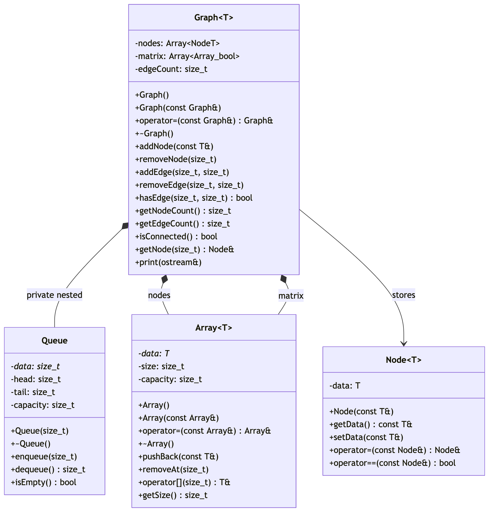

## Overview

The project implements a generic undirected graph in C++11. The graph uses an adjacency matrix for storage, with nodes represented by a dedicated class. Tests are written in a separate module. The project doesn't have a main executable. It's only the Graph data structure and the tests.

## Graph Storage

The graph nodes are stored in a dynamic array, the edges are represented by an adjacency matrix.

- The matrix is a dynamically allocated bool matrix of size nxn (n is the current number of nodes)
  - The matrix is symmetric, `matrix[i][j] == matrix[j][i]` because the graph is undirected
- Nodes are stored in a dynamically allocated array of node objects
- Both the matrix and the array are reallocated when the number of nodes change (with capacity)

## Classes

### Array

Used inside `Graph<T>` as `Array<Node<T>>` for the node list and as `Array<Array<bool>>` for the matrix row pointers.

#### Members and Methods

- `data: T*`: heap-allocated buffer
- `size: size_t`: current number of elements
- `capacity: size_t`: Allocated capacity of the buffer
- `Array() -> Array`: constructor
- `Array(const Array&) -> Array`: copy constructor
- `operator= -> Array&`: Deep copy assignment
- `~Array()`: destructor
- `pushBack(const T&)`: append element, double capacity if needed
- `removeAt(size_t)`: removes element at index and shifts other elements down
- `operator -> T&`: Element access, throws error if out of bounds
- `getSize() -> size_t`: returns the current number of elements

### Node

Wraps a single piece of data of type `T`.

#### Members and Methods

- `data: T`: the value stored by the node
- `Node(const T&)`: constructor
- `getData() -> const T&`
- `setData(const T&)`
- `operator=(const Node&)`: deep copy assignment
- `operator==(const Node<T>&)`: equality comparison
- `operator<<(ostream&, const Node<T>&)`: prints to ostream

### Graph

Owns a dynamic node array and the associated adjacency matrix.

> **Note:** the graph doesn't allow loops. This means values across the main diagonal are all 0.

#### Members and Methods

- `nodes: Array<Node<T>>`: dynamic array of all nodes
- `matrix: Array<Array<bool>>`: nxn adjacency matrix (heap-allocated)
- `edgeCount: size_t`: current number of edges
- `Graph()`: constructor
- `Graph(const Graph&)`: copy constructor
- `operator=(const Graph&)`: deep copy assignment
- `~Graph()`: destructor
- `addNode(const T&)`: add node, reallocates if needed
- `removeNode(size_t):` remove node at index, uses the `Array::removeAt()` method. Throws error if out of bounds.
- `addEdge(size_t, size_t)`: connects nodes `i` and `j`, no-op if edge already exists. Throws error if out of bounds, or `i == j` (loop).
- `removeEdge(size_t, size_t)`: no-op if edge does not exist. Throws errors if out of bounds.
- `hasEdge(size_t, size_t) -> bool`: error if out of bounds
- `getNodeCount() -> size_t`: returns `nodes.getSize()`
- `getEdgeCount() -> size_t`: returns `edgeCount` directly
- `isConnected() -> bool`: runs BFS from first node, returns true if all nodes visited
- `getNode(size_t) -> Node<T>&`: error if out of bounds
- `print(ostream&)`: prints node list and adjacency matrix
- `operator<<(ostream&, const Graph<T>&)`: friend function, calls `print()`

### Queue

A simple heap-allocated FIFO queue, using a circular buffer. Declared as a private nested struct inside `Graph<T>`. Used exclusively by the BFS algorithm. Because of this the queue is minimal, tailored for the graph's needs:

- The queue stores the node indices, not the nodes themselves
- The queue is fixed size, as the maximum number of elements is the node count
- We allocate `nodeCount + 1` slots to avoid ambiguity. If we only allocated `nodeCount` slots `head` would equal `tail` when the queue is empty, but also when the queue is full, because of the circular buffer. By adding an extra sentinel slot this never happens.

#### Members and Methods

- `data: size_t*`: fixed array of size `nodeCount + 1`
- `head: size_t`: front index
- `tail: size_t`: back index
- `capacity: size_t`: total buffer size (`nodeCount + 1`)
- `Queue(size_t)`: allocates `n + 1` slots
- `~Queue()`: destructor
- `enqueue(size_t)`: adds index, moves `tail` forward with wrapping
- `dequeue() -> size_t`: returns index, moves `head` forward with wrapping
- `isEmpty() -> bool`

## UML diagram

## Key Algorithms

### addNode - Row Expansion

- When a new node is added, the adjacency matrix grows from nxn to (n+1)x(n+1).
- The `Array<Node<T>>` handles node storage automatically via `pushBack()`.
- Both the rows and the columns of the adjacency matrix utilize the `Array` class, so they can be easily expanded with `pushBack()` as well.

### isConnected - Breadth-First Search

Returns true if every node is reachable from the first node via a [Breadth-First Search](https://en.wikipedia.org/wiki/Breadth-first_search). An empty graph (0 nodes), and a single isolated node (1 node) is considered connected.

### getEdgeCount

Instead of calculating the edge count from the upper triangle matrix, we can just keep track of edges added by `addEdge()` and `removeEdge()`. This makes this an `O(1)` operation.

## Testing

The project uses **gtest_lite**, which is preinstalled on **JPorta** and requires no external configuration. It supports batch/command-line testing, is fully redirectable to a file, and integrates cleanly with **memtrace**. I will test the most important methods of each class.
